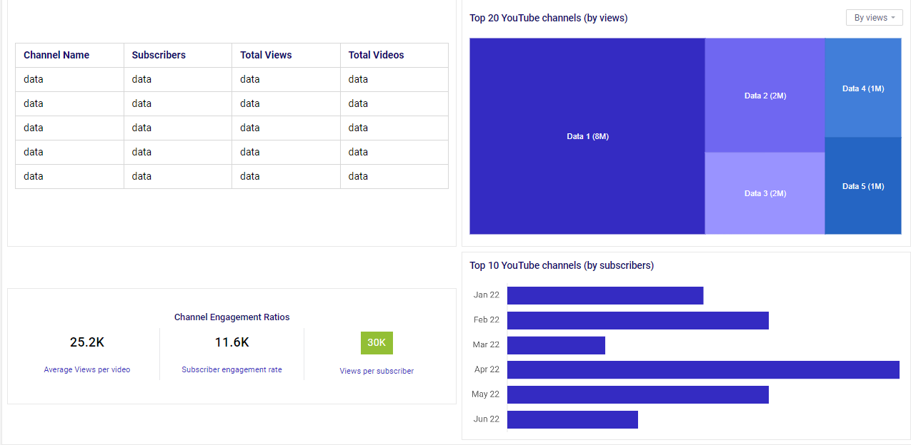
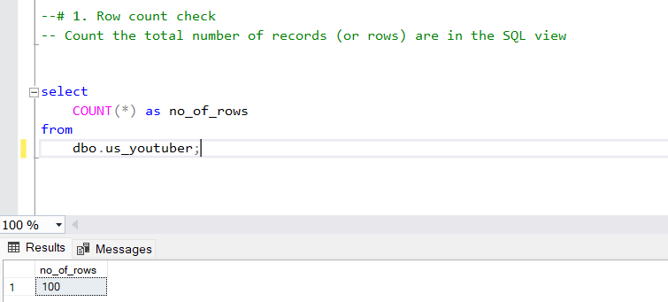
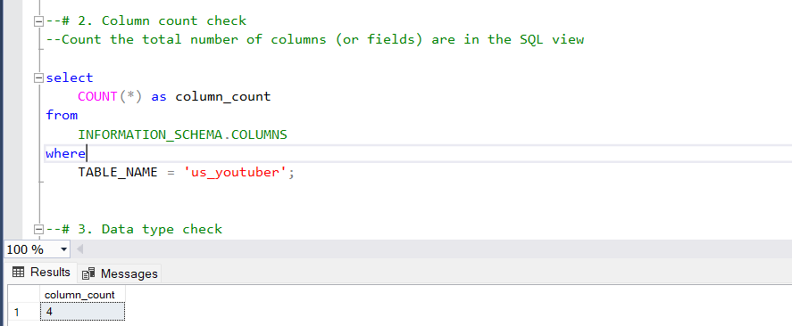
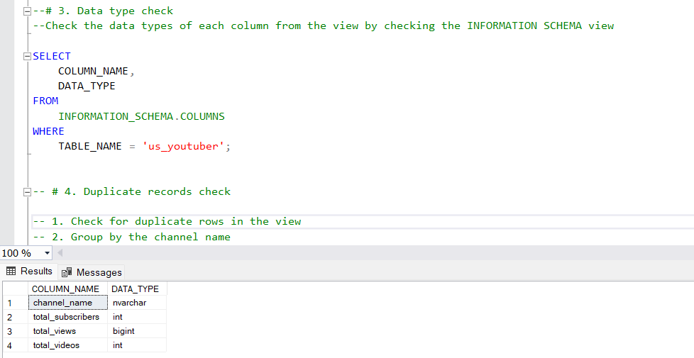
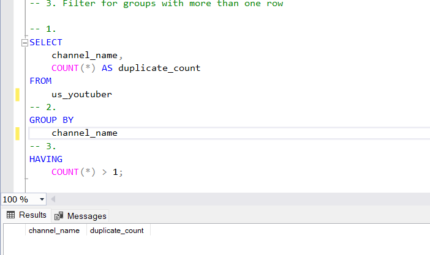
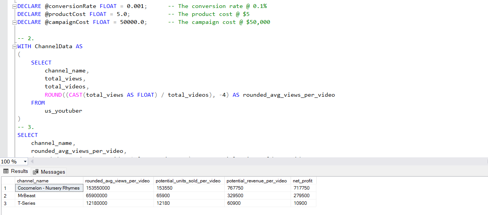
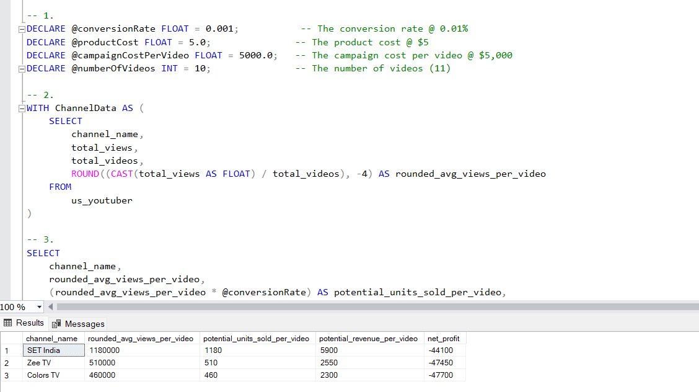
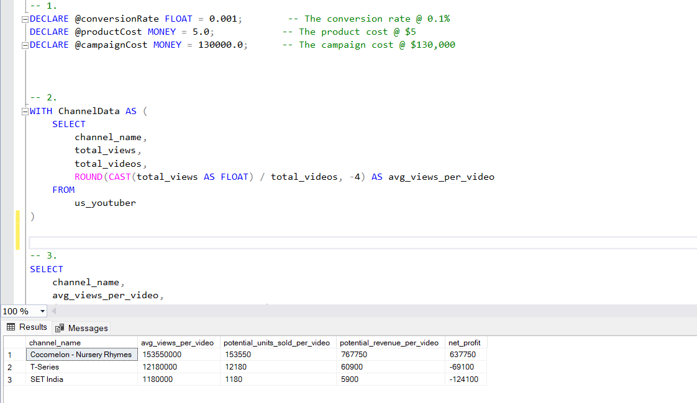

# Marketing-Analysis: SQL, Power BI, Excel, Python


# Table of contents 

- [Objective](#objective)
- [Data Source](#data-source)
- [Stages](#stages)
- [Design](#design)
  - [Mockup](#mockup)
  - [Tools](#tools)
- [Development](#development)
  - [Pseudocode](#pseudocode)
  - [Data Exploration](#data-exploration)
  - [Data Cleaning](#data-cleaning)
  - [Transform the Data](#transform-the-data)
  - [Create the SQL View](#create-the-sql-view)
- [Testing](#testing)
  - [Data Quality Tests](#data-quality-tests)
- [Visualization](#visualization)
  - [Results](#results)
  - [DAX Measures](#dax-measures)
- [Analysis](#analysis)
  - [Findings](#findings)
  - [Validation](#validation)
  - [Discovery](#discovery)
- [Recommendations](#recommendations)
  - [Potential ROI](#potential-roi)
  - [Potential Courses of Actions](#potential-courses-of-actions)
- [Conclusion](#conclusion)


# Objective 

- What is the key pain point? 

The Head of Marketing wants to find out who the top YouTubers are in 2024 to decide on which YouTubers would be best to run marketing campaigns throughout the rest of the year.


- What is the ideal solution? 

To create a dashboard that provides insights into the top US YouTubers in 2024 that includes their 
- subscriber count
- total views
- total videos, and
- engagement metrics

This will help the marketing team make informed decisions about which YouTubers to collaborate with for their marketing campaigns.

## User story 

As the Head of Marketing, I want to use a dashboard that analyses YouTube channel data in the United States . 

This dashboard should allow me to identify the top performing channels based on metrics like subscriber base and average views. 

With this information, I can make more informed decisions about which Youtubers are right to collaborate with, and therefore maximize how effective each marketing campaign is.


# Data source 

- What data is needed to achieve our objective?

We need data on the top US YouTubers in 2024 that includes their 
- channel names
- total subscribers
- total views
- total videos uploaded


- Where is the data coming from? 
The data is sourced from Kaggle (an Excel extract), [see here to find it.](https://www.kaggle.com/datasets/bhavyadhingra00020/top-100-social-media-influencers-2024-countrywise?resource=download)


# Stages

- Design
- Developement
- Testing
- Analysis 
 


# Design 

## Dashboard components required 
- What should the dashboard contain based on the requirements provided?

To understand what it should contain, we need to figure out what questions we need the dashboard to answer:

1. Who are the top 10 YouTubers with the most subscribers?
2. Which 3 channels have uploaded the most videos?
3. Which 3 channels have the most views?
4. Which 3 channels have the highest average views per video?
5. Which 3 channels have the highest views per subscriber ratio?
6. Which 3 channels have the highest subscriber engagement rate per video uploaded?

For now, these are some of the questions we need to answer, this may change as we progress down our analysis. 


## Dashboard mockup

- What should it look like? 

Some of the data visuals that may be appropriate in answering our questions include:

1. Table
2. Treemap
3. Scorecards
4. Horizontal bar chart 





## Tools 


| Tool | Purpose |
| --- | --- |
| Excel | Exploring the data |
| SQL Server | Cleaning, testing, and analyzing the data |
| Power BI | Visualizing the data via interactive dashboards |
| GitHub | Hosting the project documentation and version control |
| Python | Extracting data using Youtube API | 


# Development

## Pseudocode

- What's the general approach in creating this solution from start to finish?

1. Get the data
2. Explore the data in Excel
3. Load the data into SQL Server
4. Clean the data with SQL
5. Test the data with SQL
6. Visualize the data in Power BI
7. Generate the findings based on the insights
8. Write the documentation + commentary
9. Publish the data to GitHub Pages

## Data exploration notes

This is the stage where you have a scan of what's in the data, errors, inconcsistencies, bugs, weird and corrupted characters etc  


- What are your initial observations with this dataset? What's caught your attention so far? 

1. There are at least 4 columns that contain the data we need for this analysis, which signals we have everything we need from the file without needing to contact the client for any more data. 
2. The first column contains the channel ID with what appears to be channel IDS, which are separated by a @ symbol - we need to extract the channel names from this.
3. Some of the cells and header names are in a different language - we need to confirm if these columns are needed, and if so, we need to address them.
4. We have more data than we need, so some of these columns would need to be removed


## Data cleaning 
- What do we expect the clean data to look like? (What should it contain? What contraints should we apply to it?)

The aim is to refine our dataset to ensure it is structured and ready for analysis. 

The cleaned data should meet the following criteria and constraints:

- Only relevant columns should be retained.
- All data types should be appropriate for the contents of each column.
- No column should contain null values, indicating complete data for all records.

Below is a table outlining the constraints on our cleaned dataset:

| Property | Description |
| --- | --- |
| Number of Rows | 100 |
| Number of Columns | 4 |

And here is a tabular representation of the expected schema for the clean data:

| Column Name | Data Type | Nullable |
| --- | --- | --- |
| channel_name | VARCHAR | NO |
| total_subscribers | INTEGER | NO |
| total_views | INTEGER | NO |
| total_videos | INTEGER | NO |


- What steps are needed to clean and shape the data into the desired format?

1. Remove unnecessary columns by only selecting the ones you need
2. Extract Youtube channel names from the first column
3. Rename columns using aliases


### Transform the data 


```sql
/*
# 1. Select the required columns
# 2. Extract the channel name from the 'Name' column
*/

-- 1.
SELECT
    PARSENAME(REPLACE(Name, '@', '.'), 2) AS channel_name,
    total_subscribers,
    total_views,
    total_videos

FROM
    top_us_youtubers
```


### Create the SQL view 

```sql
/*
# 1. Create a view to store the transformed data
# 2. Cast the extracted channel name as VARCHAR(100)
# 3. Select the required columns from the top_us_youtubers_2024 SQL table 
*/

-- 1.
CREATE VIEW us_youtubers AS

-- 2.
SELECT
    PARSENAME(REPLACE(Name, '@', '.'), 2) AS channel_name, 
    total_subscribers,
    total_views,
    total_videos

-- 3.
FROM
    us_youtubers

```


# Testing 

- What data quality and validation checks are you going to create?

Here are the data quality tests conducted:

## Row count check
```sql
/*
# Count the total number of records (or rows) are in the SQL view
*/

SELECT
    COUNT(*) AS no_of_rows
FROM
    us_youtubers;

```




## Column count check
### SQL query 
```sql
/*
# Count the total number of columns (or fields) are in the SQL view
*/


SELECT
    COUNT(*) AS column_count
FROM
    INFORMATION_SCHEMA.COLUMNS
WHERE
    TABLE_NAME = 'us_youtubers'
```
### Output 



## Data type check
### SQL query 
```sql
/*
# Check the data types of each column from the view by checking the INFORMATION SCHEMA view
*/

-- 1.
SELECT
    COLUMN_NAME,
    DATA_TYPE
FROM
    INFORMATION_SCHEMA.COLUMNS
WHERE
    TABLE_NAME = 'us_youtubers';
```
### Output



## Duplicate count check
### SQL query 
```sql
/*
# 1. Check for duplicate rows in the view
# 2. Group by the channel name
# 3. Filter for groups with more than one row
*/

-- 1.
SELECT
    channel_name,
    COUNT(*) AS duplicate_count
FROM
    us_youtubers

-- 2.
GROUP BY
    channel_name

-- 3.
HAVING
    COUNT(*) > 1;
```
### Output


# Visualization 


## Results

- What does the dashboard look like?


This shows the Top US Youtubers in 2024 so far. 


## DAX Measures

### 1. Total Subscribers (M)
```sql
Total Subscribers (M) = 
VAR million = 1000000
VAR sumOfSubscribers = SUM(us_youtubers[total_subscribers])
VAR totalSubscribers = DIVIDE(sumOfSubscribers,million)

RETURN totalSubscribers

```

### 2. Total Views (B)
```sql
Total Views (B) = 
VAR billion = 1000000000
VAR sumOfTotalViews = SUM(us_youtubers[total_views])
VAR totalViews = ROUND(sumOfTotalViews / billion, 2)

RETURN totalViews

```

### 3. Total Videos
```sql
Total Videos = 
VAR totalVideos = SUM(us_youtubers[total_videos])

RETURN totalVideos

```

### 4. Average Views Per Video (M)
```sql
Average Views per Video (M) = 
VAR sumOfTotalViews = SUM(us_youtubers[total_views])
VAR sumOfTotalVideos = SUM(us_youtubers[total_videos])
VAR  avgViewsPerVideo = DIVIDE(sumOfTotalViews,sumOfTotalVideos, BLANK())
VAR finalAvgViewsPerVideo = DIVIDE(avgViewsPerVideo, 1000000, BLANK())

RETURN finalAvgViewsPerVideo 

```


### 5. Subscriber Engagement Rate
```sql
Subscriber Engagement Rate = 
VAR sumOfTotalSubscribers = SUM(us_youtubers[total_subscribers])
VAR sumOfTotalVideos = SUM(us_youtubers[total_videos])
VAR subscriberEngRate = DIVIDE(sumOfTotalSubscribers, sumOfTotalVideos, BLANK())

RETURN subscriberEngRate 

```


### 6. Views per subscriber
```sql
Views Per Subscriber = 
VAR sumOfTotalViews = SUM(us_youtubers[total_views])
VAR sumOfTotalSubscribers = SUM(us_youtubers[total_subscribers])
VAR viewsPerSubscriber = DIVIDE(sumOfTotalViews, sumOfTotalSubscribers, BLANK())

RETURN viewsPerSubscriber 

```


# Analysis 

## Findings

- What did we find?

For this analysis, we're going to focus on the questions below to get the information we need for our marketing client - 

Here are the key questions we need to answer for our marketing client: 
1. Who are the top 10 YouTubers with the most subscribers?
2. Which 3 channels have uploaded the most videos?
3. Which 3 channels have the most views?
4. Which 3 channels have the highest average views per video?
5. Which 3 channels have the highest views per subscriber ratio?
6. Which 3 channels have the highest subscriber engagement rate per video uploaded?


### 1. Who are the top 10 YouTubers with the most subscribers?

| Rank | Channel                  | Subscribers      |
|------|--------------------------|------------------|
| 1    | MrBeast                  | 289,000,000      |
| 2    | T-Series                 | 268,000,000      |
| 3    | Cocomelon - Nursery Rhymes | 177,000,000      |
| 4    | SET India                | 174,000,000      |
| 5    | ✿ Kids Diana Show        | 123,000,000      |
| 6    | Vlad and Niki            | 120,000,000      |
| 7    | Like Nastya              | 116,000,000      |
| 8    | PewDiePie                | 111,000,000      |
| 9    | Zee Music Company        | 108,000,000      |
| 10   | WWE                      | 102,000,000      |


### 2. Which 3 channels have uploaded the most videos?

| Rank | Channel     | Videos |
|------|-------------|--------------|
| 1    | Zee TV      | 178,069      |
| 2    | Colors TV   | 154,024      |
| 3    | SET India   | 140,014      |


### 3. Which 3 channels have the most views?


| Rank | Channel                  | Views            |
|------|--------------------------|------------------|
| 1    | T-Series                 | 258,896,707,763  |
| 2    | Cocomelon - Nursery Rhymes | 182,880,824,642  |
| 3    | SET India                | 165,576,494,578  |


### 4. Which 3 channels have the highest average views per video?

| Rank | Channel Name | Averge Views per Video (M) |
|------|--------------|----------------------------|
|1     | Cocomelon - Nursery Rhymes  | 153.55      |
|2     | Justin Bieber     | 131.06                |
|3     | Vlad and Niki     | 125.65                |


### 5. Which 3 channels have the highest views per subscriber ratio?

| Rank | Channel Name       | Views per Subscriber        |
|------|-----------------   |---------------------------- |
| 1    | Sony SAB           | 1246.57                     |
| 2    | Zee TV             | 1108.62                     |
| 3    | Cocomelon - Nursery Rhymes   | 1033.22           |


### 6. Which 3 channels have the highest subscriber engagement rate per video uploaded?

| Rank | Channel Name    | Subscriber Engagement Rate  |
|------|-----------------|---------------------------- |
| 1    | MrBeast         | 359900.37                   |
| 2    | Justin Bieber   | 293574.29                   |
| 3    | Vlad and Niki   | 164383.56                   |


### Notes

For this analysis, we'll prioritize analysing the metrics that are important in generating the expected ROI for our marketing client, which are the YouTube channels wuth the most 

- subscribers
- total views
- videos uploaded


## Validation 

### 1. Youtubers with the most subscribers 

#### Calculation breakdown

Campaign idea = product placement 

1. MrBeast 
- Average views per video = 6.59 million
- Product cost = $5
- Potential units sold per video = 6.59 million x 0.1% conversion rate =  65,900  units sold
- Potential revenue per video = 65,900 x $5 = $329,500 
- Campaign cost (one-time fee) = $50,000
- **Net profit = $329,500 - $50,000 = $ 279,500**

b. T-Series

- Average views per video = 1.21 million
- Product cost = $5
- Potential units sold per video = 1.21 million x 0.1% conversion rate =  12,180 units sold
- Potential revenue per video = 12,180 x $5 = $60,900
- Campaign cost (one-time fee) = $50,000
- **Net profit = $60,900 - $50,000 = $10,900**

c. Cocomelon - Nursery Rhymes

- Average views per video = 153.55 million
- Product cost = $5
- Potential units sold per video = 153.55 million x 0.1% conversion rate =  153,550 units sold
- Potential revenue per video = 153,550 x $5 = $767,750
- Campaign cost (one-time fee) = $50,000
- **Net profit = $767,750 - $50,000 = $717,750**


Best option from category: **MrBeast**


#### SQL query 

```sql
/* 

# 1. Define variables 
# 2. Create a CTE that rounds the average views per video 
# 3. Select the column you need and create calculated columns from existing ones 
# 4. Filter results by Youtube channels
# 5. Sort results by net profits (from highest to lowest)

*/

-- 1. 
DECLARE @conversionRate FLOAT = 0.001;		-- The conversion rate @ 0.1%
DECLARE @productCost FLOAT = 5.0;			-- The product cost @ $5
DECLARE @campaignCost FLOAT = 50000.0;		-- The campaign cost @ $50,000	

-- 2.  
WITH ChannelData AS 
(
    SELECT 
        channel_name,
        total_views,
        total_videos,
        ROUND((CAST(total_views AS FLOAT) / total_videos), -4) AS rounded_avg_views_per_video
    FROM 
        us_youtuber 
)
-- 3. 
SELECT 
    channel_name,
    rounded_avg_views_per_video,
    (rounded_avg_views_per_video * @conversionRate) AS potential_units_sold_per_video,
    (rounded_avg_views_per_video * @conversionRate * @productCost) AS potential_revenue_per_video,
    ((rounded_avg_views_per_video * @conversionRate * @productCost) - @campaignCost) AS net_profit
FROM 
    ChannelData

-- 4. 
WHERE 
    channel_name in ('MrBeast', 'T-Series', 'Cocomelon - Nursery Rhymes')    

-- 5.  
ORDER BY
	net_profit DESC
```

#### Output



### 2. Youtubers with the most videos uploaded

### Calculation breakdown 

Campaign idea = sponsored video series  

1. Zee TV
- Average views per video = 510,000
- Product cost = $5
- Potential units sold per video = 510,000 x 0.1% conversion rate = 510 units sold
- Potential revenue per video = 510 x $5= $2,550
- Campaign cost (10-videos @ $5,000 each) = $50,000
- **Net profit = $2,550 - $50,000 = -$-47450 (potential loss)**

b. Colors TV

- Average views per video = 460,000
- Product cost = $5
- Potential units sold per video = 460,000 x 0.1% conversion rate = 460 units sold
- Potential revenue per video = 460 x $5= $2300
- Campaign cost (10-videos @ $5,000 each) = $50,000
- **Net profit = $2300 - $50,000 = -$-47700 (potential loss)**

b. SET India

- Average views per video = 1,180,000
- Product cost = $5
- Potential units sold per video = 1,180,000 x 0.1% conversion rate = 1180 units sold
- Potential revenue per video = 1180 x $5= $5,900
- Campaign cost (10-videos @ $5,000 each) = $50,000
- **Net profit = $5,900 - $50,000 = $44,100 (potential loss)**


Best option from category: **None of them**

#### SQL query 
```sql
/* 
# 1. Define variables
# 2. Create a CTE that rounds the average views per video
# 3. Select the columns you need and create calculated columns from existing ones
# 4. Filter results by YouTube channels
# 5. Sort results by net profits (from highest to lowest)
*/

-- 1.
DECLARE @conversionRate FLOAT = 0.001;           -- The conversion rate @ 0.01%
DECLARE @productCost FLOAT = 5.0;               -- The product cost @ $5
DECLARE @campaignCostPerVideo FLOAT = 5000.0;   -- The campaign cost per video @ $5,000
DECLARE @numberOfVideos INT = 10;               -- The number of videos (11)

-- 2.
WITH ChannelData AS (
    SELECT
        channel_name,
        total_views,
        total_videos,
        ROUND((CAST(total_views AS FLOAT) / total_videos), -4) AS rounded_avg_views_per_video
    FROM
        us_youtuber 
)

-- 3.
SELECT
    channel_name,
    rounded_avg_views_per_video,
    (rounded_avg_views_per_video * @conversionRate) AS potential_units_sold_per_video,
    (rounded_avg_views_per_video * @conversionRate * @productCost) AS potential_revenue_per_video,
    ((rounded_avg_views_per_video * @conversionRate * @productCost) - (@campaignCostPerVideo * @numberOfVideos)) AS net_profit
FROM
    ChannelData

-- 4.
WHERE
    channel_name IN ('Zee TV', 'Colors TV', 'SET India')

-- 5.
ORDER BY
    net_profit DESC;
```

#### Output




### 3.  Youtubers with the most views 

#### Calculation breakdown

Campaign idea = Influencer marketing 

a. T-Series

- Average views per video = 12.18 million
- Product cost = $5
- Potential units sold per video = 12.18 million x 0.1% conversion rate = 12,180 units sold
- Potential revenue per video = 12,180x $5 = $60,900
- Campaign cost (3-month contract) = $130,000
- **Net profit = $60,900 - $130,000 = -$69100**

b. Cocomelon - Nursery Rhymes

- Average views per video = 153.5 million
- Product cost = $5
- Potential units sold per video = 153.5 million x 0.1% conversion rate = 153,550 units sold
- Potential revenue per video = 153,550 x $5 = $767,750
- Campaign cost (3-month contract) = $130,000
- **Net profit = $767,750 - $130,000 = $637,750**

c. SET India

- Average views per video = 1.18 million
- Product cost = $5
- Potential units sold per video = 1.18 million x 0.1% conversion rate = 1,180 units sold
- Potential revenue per video = 1,180 x $5 = $5,900
- Campaign cost (3-month contract) = $130,000
- **Net profit = $5,900 - $130,000 = -$124100**

Best option from category: **Cocomelon - Nursery Rhymes** 


#### SQL query 
```sql
/*
# 1. Define variables
# 2. Create a CTE that rounds the average views per video
# 3. Select the columns you need and create calculated columns from existing ones
# 4. Filter results by YouTube channels
# 5. Sort results by net profits (from highest to lowest)
*/


-- 1.
DECLARE @conversionRate FLOAT = 0.001;        -- The conversion rate @ 0.1%
DECLARE @productCost MONEY = 5.0;            -- The product cost @ $5
DECLARE @campaignCost MONEY = 130000.0;      -- The campaign cost @ $130,000


-- 2.
WITH ChannelData AS (
    SELECT
        channel_name,
        total_views,
        total_videos,
        ROUND(CAST(total_views AS FLOAT) / total_videos, -4) AS avg_views_per_video
    FROM
        us_youtuber 
)

-- 3.
SELECT
    channel_name,
    avg_views_per_video,
    (avg_views_per_video * @conversionRate) AS potential_units_sold_per_video,
    (avg_views_per_video * @conversionRate * @productCost) AS potential_revenue_per_video,
    (avg_views_per_video * @conversionRate * @productCost) - @campaignCost AS net_profit
FROM
    ChannelData

-- 4.
WHERE
    channel_name IN ('T-Series', 'Cocomelon - Nursery Rhymes', 'SET India')


-- 5.
ORDER BY
    net_profit DESC;
```

#### Output




## Discovery

- What did we learn?

We discovered that 


1. MrBeast, T-series and Cocomelon - Nursery Rhymes are the channnels with the most subscribers in the United States
2. Zee TV, Colors TV and SET India are the channels with the most videos uploaded
3. T-Series, Cocomelon - Nursery Rhymes and SET India are the channels with the most views
4. Entertainment channels are useful for broader reach, as the channels posting consistently on their platforms and generating the most engagement are focus on entertainment and music 


## Recommendations 

- What do you recommend based on the insights gathered? 
  
1. MrBeast is the best YouTube channel to collaborate with if we want to maximize visbility because this channel has the most YouTube subscribers in the United States
2. Although T-Series, Cocomelon - Nursery Rhymes and SET India are regular publishers on YouTube, it may be worth considering whether collaborating with them with the current budget caps are worth the effort, as the potential return on investments is significantly lower compared to the other channels.
3. T-Series is the best YouTuber to collaborate with if we're interested in maximizing reach, but collaborating with MrBeast may be better long-term options considering the fact that they both have large subscriber bases and are averaging significantly high number of views.
4. The top 3 channels to form collaborations with are MrBeast, T-series and Cocomelon - Nursery Rhymes based on this analysis, because they attract the most engagement on their channels consistently.


### Potential ROI 
- What ROI do we expect if we take this course of action?

1. Setting up a collaboration deal with MrBeast would make the client a net profit of $279,500 per video
2. An influencer marketing contract with Cocomelon - Nursery Rhymes can see the client generate a net profit of $637,750 but not recommended, since its a kids channel 
3. If we go with a product placement campaign with any of the selected youtubers it will lead into no net profit. 


### Action plan
- What course of action should we take and why?

Based on our analysis, we beieve the best channel to advance a long-term partnership deal with to promote the client's products is the MrBeast channel. 

We'll have conversations with the marketing client to forecast what they also expect from this collaboration. Once we observe we're hitting the expected milestones, we'll advance with potential partnerships with Cocomelon - Nursery Rhymes and T-Series in the future.   

- What steps do we take to implement the recommended decisions effectively?


1. Reach out to the teams behind each of these channels, starting with MrBeast
2. Negotiate contracts within the budgets allocated to each marketing campaign
3. Kick off the campaigns and track each of their performances against the KPIs
4. Review how the campaigns have gone, gather insights and optimize based on feedback from converted customers and each channel's audiences 
